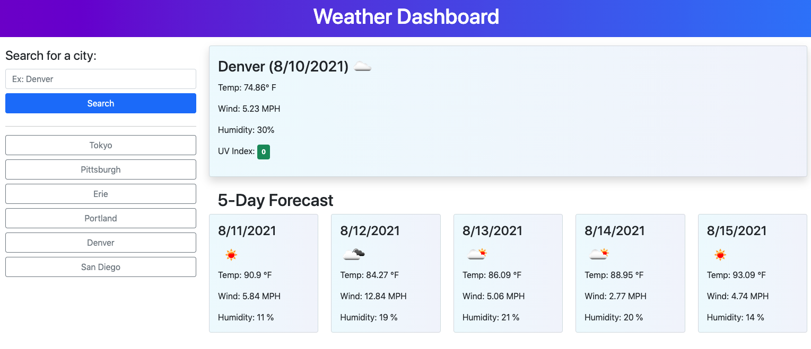

# Homework Assignment #6: Weather App

## Overview

This app takes user input in the form of a city name and returns the current day weather data for the city as well as the 5-day forecast for the city using the OpenWeather API. It also returns the city's UV index and has a visual color indicator based on the severity of the UV index at the time. Search history is added to local browser storage for easy recall. The app clears previous weather data before new weather data is populated. Error checking on the input field is performed to ensure the user does not input a numeric value or leave the field blank. The app was built using Bootstrap for responsiveness and utilizes JavaScript, jQuery, and Moment.js for functionality.

## Link to Deployed Application

[Weather App](https://matthewbush55.github.io/weather-app/)

## Mock-Up

